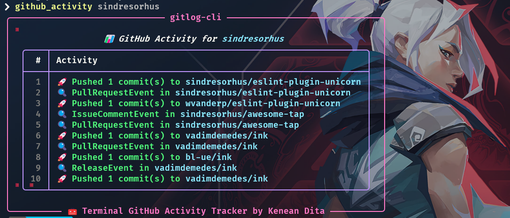

# Gitlog-cli

[]()
[]()

> **Gitlog-cli** is a terminal-based Python application that displays a user's GitHub activity in a clean and readable format. Ideal for developers who prefer staying in the command line.


## Screenshots

<p align="center">
  
  <br/><br/>
  
</p>

## Features

- View recent GitHub activity (commits, PRs, issues)
- Pretty terminal output using `rich`
- Lightweight and fast
- Cross-platform

## Installation

```bash
git clone https://github.com/keneandita/gitlog-cli.git
cd gitlog-cli
```

Install dependencies:

```bash
pip install -r requrements.txt
```

### Usage

```bash
python .\main.py --username
```

Or you can set up a global shortcut by editing your default profile.
For Windows:

```bash
notepad.exe $PROFILE
```

Add this to your script with the correct path of the cloned repo.

```notepad
function github_activity {
    python "C:\Users\..." $args
}
```

### Author

**Kenean Dita**
[GitHub](https://github.com/kenean-dita) | [LinkedIn](https://www.linkedin.com/in/keneandita/)

Show Your Support
If you find this project helpful, please consider giving it a ⭐

### License

This project is licensed under the MIT License - see the [LICENSE](./LICENSE) file for details.
